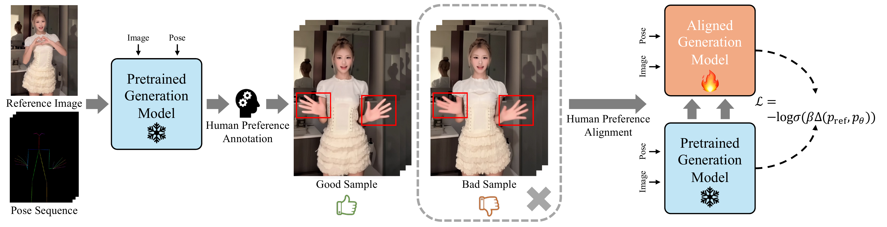

<div align="center">

# Implicit Preference Alignment for Human Image Animation

**ICML 2026**

[Yuanzhi Wang](https://mdswyz.github.io/), Xuhua Ren, Jiaxiang Cheng, Bing Ma, Kai Yu,  
Tianxiang Zheng, Qinglin Lu, Zhen Cui

Tencent Hunyuan

[Paper](https://arxiv.org/abs/2605.07545) | [Repository](https://github.com/mdswyz/IPA)

</div>

> **TL;DR:** We introduce Implicit Preference Alignment (IPA), a pair-free
> post-training objective that learns from self-generated high-quality videos
> while staying close to a frozen pretrained flow model.

## Highlights

- **No strict preference pairs.** IPA learns from curated good samples without
  requiring a matched bad sample for every training example.
- **Implicit reward maximization.** A frozen pretrained model anchors the
  trainable model while the KL-gap objective moves it toward the preference
  distribution.

## Framework Overview

<p align="center">
  
</p>

<p align="center"><em>
Figure 1. IPA removes the need for bad samples and aligns a trainable model
against a frozen pretrained reference through an implicit preference objective.
</em></p>

Standard DPO-style preference optimization requires strict good-bad pairs. This is
particularly expensive for human animation because hand quality can vary from
frame to frame. IPA instead uses only self-generated videos that satisfy human
preferences. It learns the high-quality patterns in those samples while a
frozen reference model preserves the pretrained prior.

## Method

### Implicit Preference Alignment

Let $q$ be the trajectory distribution of curated good samples,
$p_{\mathrm{ref}}$ the frozen pretrained model, and $p_\theta$ the trainable
model. We define the KL-divergence gap as

$$
\Delta(p_{\mathrm{ref}}, p_\theta)
= D_{\mathrm{KL}}(q \| p_{\mathrm{ref}})
- D_{\mathrm{KL}}(q \| p_\theta).
$$

A positive gap means that the trainable model is closer to the preference
distribution than the reference model. IPA encourages this through

$$
\mathcal{L}_{\mathrm{IPA}}
= -\log \sigma\!\left(\beta\,\Delta(p_{\mathrm{ref}},p_\theta)\right),
$$

where $\beta$ controls how strongly the aligned model is constrained by the
pretrained prior. The paper shows that maximizing this gap is equivalent, up to
a constant, to maximizing an implicit reward.

### Flow IPA

For flow matching, let $\mathbf{Z}_t=t\mathbf{Z}_1+(1-t)\mathbf{Z}_0$ and
$v=\mathbf{Z}_1-\mathbf{Z}_0$. The frozen and trainable velocity fields are
$v_{\mathrm{ref}}$ and $v_\theta$, respectively. Flow IPA
preference objective is

$$
\begin{aligned}
\mathcal{L}_{\mathrm{Flow-IPA}}
= \mathbb{E}_{t \sim \mathcal{U}(0,1),\,v}
\Bigg[
-\log \sigma\!\Bigg(
\frac{\beta}{2}(1-t)^2
\Big(&
\left\|v-v_{\mathrm{ref}}(\mathbf{Z}_t;t,I,P)\right\|_2^2 \\
&-
\left\|v-v_\theta(\mathbf{Z}_t;t,I,P)\right\|_2^2
\Big)
\Bigg)
\Bigg].
\end{aligned}
$$

Here, $I$ is the reference image and $P$ is the pose sequence.

## Core IPA + HALO Implementation

```python
import torch
import torch.nn.functional as F


def halo_error(prediction, target, hand_mask, hand_region_weight=10.0):
    """Return the per-sample HALO-weighted flow error.

    `hand_region_weight` is the final multiplier on hand pixels. A value of
    10.0 gives hand pixels 10x weight and background pixels 1x weight.
    """

    squared_error = (prediction.float() - target.float()).square()
    hand_mask = hand_mask.to(
        device=squared_error.device,
        dtype=squared_error.dtype,
    ).clamp(0, 1)

    video_weight = 1.0 + (hand_region_weight - 1.0) * hand_mask
    weighted_error = torch.cat(
        [
            squared_error[:, :, :1],
            squared_error[:, :, 1:] * video_weight,
        ],
        dim=2,
    )
    return weighted_error.flatten(1).mean(1)


def ipa_halo_loss(
    model_prediction,
    reference_prediction,
    target,
    normalized_timestep,
    hand_mask,
    beta,
    hand_region_weight,
):
    """Compute pair-free IPA with HALO.

    Args:
        model_prediction: v_theta from the trainable model.
        reference_prediction: v_ref from the frozen reference model.
        target: flow target v = Z_1 - Z_0.
        normalized_timestep: [B] values in [0, 1].
        hand_mask: latent-space hand mask.
    """
    model_error = halo_error(
        model_prediction,
        target,
        hand_mask,
        hand_region_weight,
    )
    with torch.no_grad():
        reference_error = halo_error(
            reference_prediction,
            target,
            hand_mask,
            hand_region_weight,
        )

    # Positive when the trainable model improves on the frozen reference.
    improvement = reference_error - model_error
    t = normalized_timestep.float().reshape(-1)
    if t.numel() != improvement.numel():
        raise ValueError("one normalized timestep is required per sample")

    logits = 0.5 * beta * (1.0 - t).square() * improvement
    loss = -F.logsigmoid(logits).mean()
    metrics = {
        "ipa_gap": improvement.detach().mean(),
        "model_error": model_error.detach().mean(),
        "reference_error": reference_error.detach().mean(),
    }
    return loss, metrics
```

Minimal integration into a flow-matching training step:

```python
import copy


# Create a distinct reference after loading the shared base and initial adapter
# weights, but before optimizer construction or distributed wrapping. Loading a
# second instance from the same checkpoint is equivalent.
reference_model = copy.deepcopy(model).requires_grad_(False).eval()

model_prediction = model(noisy_latents, t=timesteps, **model_kwargs)[0]
with torch.no_grad():
    reference_prediction = reference_model(
        noisy_latents,
        t=timesteps,
        **model_kwargs,
    )[0]

target = noise - clean_latents
normalized_timestep = timesteps.float() / num_train_timesteps

loss_ipa, metrics = ipa_halo_loss(
    model_prediction,
    reference_prediction,
    target,
    normalized_timestep,
    hand_mask,
    beta=600.0,
    hand_region_weight=10.0,
)
```

## Citation

If you find this work useful, please cite:

```bibtex
@inproceedings{wang2026implicit,
  title={Implicit Preference Alignment for Human Image Animation},
  author={Wang, Yuanzhi and Ren, Xuhua and Cheng, Jiaxiang and Ma, Bing and Yu, Kai and Zheng, Tianxiang and Lu, Qinglin and Cui, Zhen},
  booktitle = {Proceedings of the 43rd International Conference on Machine Learning},
  year={2026}
}
```
